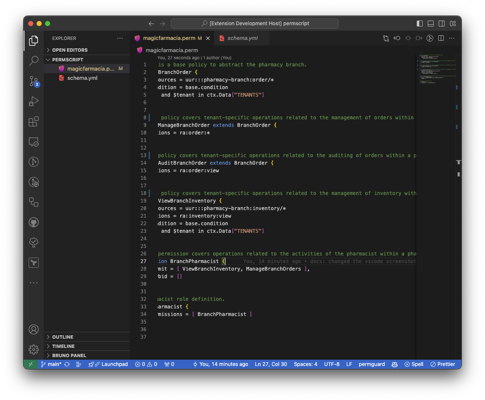

# PermGuard

`PermGuard` an Open Source Multi-Account and Multi-Tenant Authorization Provider that implements the authorization layer, enabling the segregation of the application's authorization logic from the core application code.

As an `PermGuard administrator` you can create multiple accounts and create multiple schemas within each account.

All you have to do is describe your schema's `resources` within your account and create your own access control policies. Resources are organized into schema's domains.

`PermGuard` allows to specify who or what can access resources by the means of fine-grained permissions:

- `Who`: *Identities (Users and Roles) authenticated in the application*
- `Can Access`: *Permissions granted by attaching policies*
- `Resources`: *Resources targeted by permissions*

To enforce the access control process, the application implements the Policy Enforcement Point using the available SDKs

