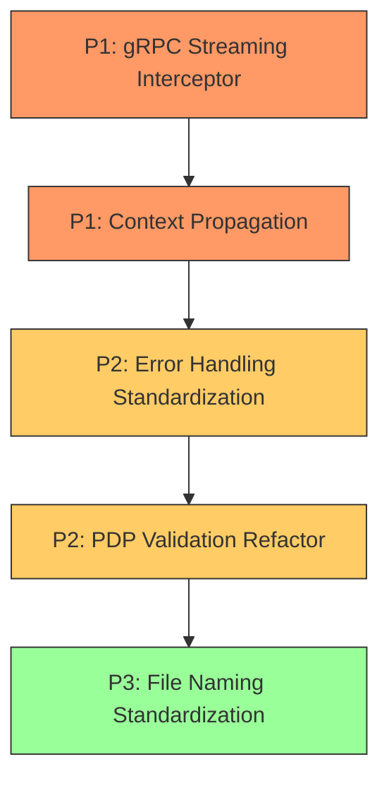

# Architectural Improvements Plan

> **Status:** Draft
> **Date:** 2026-03-06
> **Scope:** SUGGESTION-level findings from architectural review

---

## Table of Contents

1. [Context Propagation](#1-context-propagation)
2. [Error Handling Standardization](#2-error-handling-standardization)
3. [PDP Validation Refactor](#3-pdp-validation-refactor)
4. [gRPC Streaming Interceptor](#4-grpc-streaming-interceptor)
5. [File Naming Standardization](#5-file-naming-standardization-docgo-vs-docsgo)

---

## 1. Context Propagation

### Summary

Database operations and transaction initialization throughout the storage layer use `context.Background()` instead of propagating the caller's request context. This prevents request cancellation, timeout enforcement, and distributed tracing from working end-to-end.

### Priority: P1

### Current State

Three categories of `context.Background()` misuse exist:

**Category A — Repository-level SQL operations** (~20+ call sites in `plugin/storage/sqlite/internal/centralstorage/repositories/`):

Every `ExecContext()` and `QueryRowContext()` call passes `context.Background()`. For example, in [`ledgers_repo.go`](plugin/storage/sqlite/internal/centralstorage/repositories/ledgers_repo.go:92):

```go
// Current: context is discarded
result, err = tx.ExecContext(context.Background(), "INSERT INTO ledgers ...")
```

Similarly in [`zones_repo.go`](plugin/storage/sqlite/internal/centralstorage/repositories/zones_repo.go:68):

```go
result, err = tx.ExecContext(context.Background(), "INSERT INTO zones ...")
```

**Category B — Transaction initialization** (`BeginTx` calls in `plugin/storage/sqlite/internal/centralstorage/`):

Every `BeginTx()` call in the central storage layer uses `context.Background()`. For example, in [`pap_ledgers.go`](plugin/storage/sqlite/internal/centralstorage/pap_ledgers.go:42):

```go
tx, err := db.BeginTx(context.Background(), nil)
```

This pattern repeats in [`pap_ledgers.go:78`](plugin/storage/sqlite/internal/centralstorage/pap_ledgers.go:78), [`pap_ledgers.go:112`](plugin/storage/sqlite/internal/centralstorage/pap_ledgers.go:112), and equivalent files for zones.

**Category C — Network listener** in [`endpoint.go`](internal/agents/services/endpoint.go:123):

```go
lc := net.ListenConfig{}
lis, err := lc.Listen(context.Background(), "tcp", fmt.Sprintf(":%d", port))
```

### Impact

- **No request cancellation propagation:** If a gRPC client disconnects, in-flight database queries continue executing.
- **No timeout enforcement:** Long-running queries cannot be bounded by request-level deadlines.
- **No distributed tracing:** Context-based trace IDs (e.g., OpenTelemetry spans) cannot flow through the storage layer.

### Proposed Change

#### Phase 1: Add `context.Context` to public storage interfaces

Start from the package-level interfaces in `pkg/agents/storage/` and propagate downward.

**Step 1 — Update [`storage_pap.go`](pkg/agents/storage/storage_pap.go:27):**

```go
// Before
type PAPCentralStorage interface {
    CreateLedger(ledger *azmodelspap.Ledger) (*azmodelspap.Ledger, error)
    // ...
}

// After
type PAPCentralStorage interface {
    CreateLedger(ctx context.Context, ledger *azmodelspap.Ledger) (*azmodelspap.Ledger, error)
    // ...
}
```

Apply the same change to [`storage_zap.go`](pkg/agents/storage/storage_zap.go:24) and [`storage_pdp.go`](pkg/agents/storage/storage_pdp.go:23).

**Step 2 — Update the internal `SqliteRepo` interface** in [`centralstorage.go`](plugin/storage/sqlite/internal/centralstorage/centralstorage.go:30):

```go
// Before
type SqliteRepo interface {
    UpsertZone(tx *sql.Tx, isCreate bool, zone *repos.Zone) (*repos.Zone, error)
    // ...
}

// After
type SqliteRepo interface {
    UpsertZone(ctx context.Context, tx *sql.Tx, isCreate bool, zone *repos.Zone) (*repos.Zone, error)
    // ...
}
```

**Step 3 — Update repository implementations.** Example for [`ledgers_repo.go`](plugin/storage/sqlite/internal/centralstorage/repositories/ledgers_repo.go:70):

```go
// Before
func (r *Repository) UpsertLedger(tx *sql.Tx, isCreate bool, ledger *Ledger) (*Ledger, error) {
    // ...
    result, err = tx.ExecContext(context.Background(), "INSERT INTO ledgers ...")
}

// After
func (r *Repository) UpsertLedger(ctx context.Context, tx *sql.Tx, isCreate bool, ledger *Ledger) (*Ledger, error) {
    // ...
    result, err = tx.ExecContext(ctx, "INSERT INTO ledgers ...")
}
```

**Step 4 — Update central storage methods** to pass context through `BeginTx`. Example for [`pap_ledgers.go`](plugin/storage/sqlite/internal/centralstorage/pap_ledgers.go:34):

```go
// Before
func (s SQLiteCentralStoragePAP) CreateLedger(ledger *pap.Ledger) (*pap.Ledger, error) {
    db, err := s.sqlExec.Connect(s.ctx, s.sqliteConnector)
    tx, err := db.BeginTx(context.Background(), nil)
    dbOutLedger, err := s.sqlRepo.UpsertLedger(tx, true, dbInLedger)
}

// After
func (s SQLiteCentralStoragePAP) CreateLedger(ctx context.Context, ledger *pap.Ledger) (*pap.Ledger, error) {
    db, err := s.sqlExec.Connect(s.ctx, s.sqliteConnector)
    tx, err := db.BeginTx(ctx, nil)
    dbOutLedger, err := s.sqlRepo.UpsertLedger(ctx, tx, true, dbInLedger)
}
```

**Step 5 — Thread context from gRPC handlers.** The gRPC server methods already receive a `context.Context` parameter (currently discarded as `_`). Example from [`pap_grpc_server.go`](internal/agents/services/pap/endpoints/api/v1/pap_grpc_server.go:96):

```go
// Before
func (s *PAPServer) CreateLedger(_ context.Context, ledgerRequest *LedgerCreateRequest) (*LedgerResponse, error) {
    ledger, err := s.service.CreateLedger(&pap.Ledger{...})
}

// After
func (s *PAPServer) CreateLedger(ctx context.Context, ledgerRequest *LedgerCreateRequest) (*LedgerResponse, error) {
    ledger, err := s.service.CreateLedger(ctx, &pap.Ledger{...})
}
```

#### Phase 2: Fix the network listener

For [`endpoint.go`](internal/agents/services/endpoint.go:123), propagate the parent context:

```go
// Before
func (e *Endpoint) Serve(_ context.Context, serviceCtx *services.ServiceContext) (bool, error) {
    lc := net.ListenConfig{}
    lis, err := lc.Listen(context.Background(), "tcp", fmt.Sprintf(":%d", port))
}

// After
func (e *Endpoint) Serve(ctx context.Context, serviceCtx *services.ServiceContext) (bool, error) {
    lc := net.ListenConfig{}
    lis, err := lc.Listen(ctx, "tcp", fmt.Sprintf(":%d", port))
}
```

### Affected Files/Interfaces

| Layer | Files | Change Type |
|-------|-------|-------------|
| Public interfaces | `pkg/agents/storage/storage_pap.go`, `storage_zap.go`, `storage_pdp.go` | Add `ctx context.Context` first param |
| Internal interfaces | `plugin/storage/sqlite/internal/centralstorage/centralstorage.go` | Add `ctx` to `SqliteRepo` interface |
| Repository impl | `plugin/storage/sqlite/internal/centralstorage/repositories/ledgers_repo.go`, `zones_repo.go`, `keyvalues.go` | Replace `context.Background()` with `ctx` |
| Central storage | `plugin/storage/sqlite/internal/centralstorage/pap_ledgers.go`, `zap_zones.go`, `pap_notp.go`, `pap_notp_push.go`, `pap_notp_pull.go`, `pdp_policystore.go` | Thread `ctx` through `BeginTx` and repo calls |
| Controllers | `internal/agents/services/pap/controllers/pap_controller.go`, `pdp/controllers/pdp_controller.go`, `zap/controllers/zap_controller.go` | Accept and pass `ctx` |
| gRPC servers | `internal/agents/services/pap/endpoints/api/v1/pap_grpc_server.go`, `pdp/.../pdp_grpc_server.go`, `zap/.../zap_grpc_server.go` | Stop discarding `ctx` parameter |
| Endpoint | `internal/agents/services/endpoint.go` | Use parent `ctx` for `lc.Listen` |
| Tests / Mocks | All `_test.go` and mock files for the above | Update signatures |

### Migration Pattern

1. Update interfaces top-down: `pkg/agents/storage/` → internal interfaces → implementations.
2. The compiler will flag every call site that needs updating.
3. For each call site, replace `context.Background()` with the `ctx` parameter received from the caller.
4. Update tests to pass `context.TODO()` or `context.Background()` where no real context exists.

### Estimated Effort

~30 files, primarily mechanical signature changes driven by compiler errors.

---

## 2. Error Handling Standardization

### Summary

The codebase uses three distinct error construction patterns inconsistently: `errors.Join()`, `fmt.Errorf("%w", ...)`, and bare `errors.New()`. There are no sentinel errors or typed errors for well-known storage conditions (e.g., not-found, conflict, validation failure).

### Priority: P2

### Current State

**Pattern 1 — `errors.Join()`** found in repositories, e.g. [`ledgers_repo.go`](plugin/storage/sqlite/internal/centralstorage/repositories/ledgers_repo.go:75):

```go
return nil, errors.Join(fmt.Errorf(errorMessageLedgerInvalidZoneID, ledger.ZoneID), err)
```

**Pattern 2 — `fmt.Errorf` with `%w`** is not consistently used; instead formatted strings without wrapping are common.

**Pattern 3 — bare `errors.New()`** in central storage, e.g. [`pap_ledgers.go`](plugin/storage/sqlite/internal/centralstorage/pap_ledgers.go:36):

```go
return nil, errors.New("storage: invalid client input - ledger is nil")
```

**Pattern 4 — Custom wrappers** in [`errors.go`](plugin/storage/sqlite/internal/centralstorage/repositories/errors.go:36) use `errors.Join` internally:

```go
func WrapSqliteErrorWithParams(msg string, err error, _ map[string]string) error {
    return errors.Join(fmt.Errorf("generic error (%s)", msg), err)
}
```

**No sentinel errors:** Callers cannot use `errors.Is()` to detect specific conditions like "not found" or "already exists".

### Proposed Change

#### Step 1: Define sentinel errors in `pkg/agents/storage/`

Create a new file [`pkg/agents/storage/storage_errors.go`](pkg/agents/storage/storage_errors.go):

```go
package storage

import "errors"

// Sentinel errors for well-known storage conditions.
var (
    // ErrNotFound is returned when a requested entity does not exist.
    ErrNotFound = errors.New("storage: entity not found")

    // ErrAlreadyExists is returned when creating an entity that already exists.
    ErrAlreadyExists = errors.New("storage: entity already exists")

    // ErrConflict is returned when a concurrent modification is detected.
    ErrConflict = errors.New("storage: conflict detected")

    // ErrInvalidInput is returned when the caller provides invalid parameters.
    ErrInvalidInput = errors.New("storage: invalid input")

    // ErrInternal is returned for unexpected internal storage failures.
    ErrInternal = errors.New("storage: internal error")
)
```

#### Step 2: Standardize on `fmt.Errorf` with `%w` for wrapping

The recommended pattern for all new and migrated code:

```go
// Wrapping a sentinel with additional context
return fmt.Errorf("CreateLedger: zone_id=%d ledger=%s: %w", zoneID, name, storage.ErrInvalidInput)

// Wrapping a sentinel + underlying error
return fmt.Errorf("CreateLedger: %w: %w", storage.ErrNotFound, err)
```

> **Note:** Go 1.20+ supports multiple `%w` verbs in a single `fmt.Errorf`, making `errors.Join` unnecessary for most cases.

#### Step 3: Update `WrapSqliteError` to use sentinel errors

Refactor [`errors.go`](plugin/storage/sqlite/internal/centralstorage/repositories/errors.go:30) to map SQLite error codes to sentinel errors:

```go
package repositories

import (
    "errors"
    "fmt"

    "github.com/permguard/permguard/pkg/agents/storage"
)

func WrapSqliteError(msg string, err error) error {
    if err == nil {
        return fmt.Errorf("%s: %w", msg, storage.ErrInternal)
    }
    // Map known SQLite error patterns to sentinel errors
    errStr := err.Error()
    switch {
    case contains(errStr, "UNIQUE constraint failed"):
        return fmt.Errorf("%s: %w: %w", msg, storage.ErrAlreadyExists, err)
    case contains(errStr, "FOREIGN KEY constraint failed"):
        return fmt.Errorf("%s: %w: %w", msg, storage.ErrInvalidInput, err)
    case errors.Is(err, sql.ErrNoRows):
        return fmt.Errorf("%s: %w: %w", msg, storage.ErrNotFound, err)
    default:
        return fmt.Errorf("%s: %w: %w", msg, storage.ErrInternal, err)
    }
}
```

#### Step 4: Enable `errors.Is()` in callers

After migration, gRPC servers can map storage errors to gRPC status codes:

```go
import (
    "errors"
    "google.golang.org/grpc/codes"
    "google.golang.org/grpc/status"

    "github.com/permguard/permguard/pkg/agents/storage"
)

func mapStorageError(err error) error {
    switch {
    case errors.Is(err, storage.ErrNotFound):
        return status.Error(codes.NotFound, err.Error())
    case errors.Is(err, storage.ErrAlreadyExists):
        return status.Error(codes.AlreadyExists, err.Error())
    case errors.Is(err, storage.ErrInvalidInput):
        return status.Error(codes.InvalidArgument, err.Error())
    case errors.Is(err, storage.ErrConflict):
        return status.Error(codes.Aborted, err.Error())
    default:
        return status.Error(codes.Internal, err.Error())
    }
}
```

### Affected Files/Interfaces

| Layer | Files | Change |
|-------|-------|--------|
| New file | `pkg/agents/storage/storage_errors.go` | Define sentinel errors |
| Repository errors | `plugin/storage/sqlite/internal/centralstorage/repositories/errors.go` | Map SQLite errors to sentinels |
| Repository impl | `repositories/ledgers_repo.go`, `zones_repo.go`, `keyvalues.go` | Use `fmt.Errorf` with `%w` |
| Central storage | `pap_ledgers.go`, `zap_zones.go`, `pap_notp*.go`, `pdp_policystore.go` | Replace `errors.New` / `errors.Join` with sentinel wrapping |
| gRPC servers | `pap_grpc_server.go`, `pdp_grpc_server.go`, `zap_grpc_server.go` | Add error-to-status mapping |

### Migration Guidance

1. Create `storage_errors.go` first — no breaking changes.
2. Migrate `WrapSqliteError` — all callers automatically benefit.
3. Incrementally replace `errors.New()` and `errors.Join()` in storage layer with `fmt.Errorf("...: %w", sentinel)`.
4. Add `mapStorageError()` helper to gRPC layer and call it in server methods.

### Estimated Effort

~25 files. Sentinel definition is small; migration is incremental and can be done per-file.

---

## 3. PDP Validation Refactor

### Summary

The [`AuthorizationCheck()`](internal/agents/services/pdp/controllers/pdp_controller.go:63) method in the PDP controller is ~300 lines long with ~20 repetitive validation blocks that follow the same pattern: check a field, build an error message, append an error evaluation response, and `continue`.

### Priority: P2

### Current State

In [`pdp_controller.go`](internal/agents/services/pdp/controllers/pdp_controller.go:63), the validation section (lines 89–167) has repetitive blocks like:

```go
if request.AuthorizationModel.ZoneID == 0 {
    errMsg := fmt.Sprintf("%s: invalid zone id", authzen.AuthzErrBadRequestMessage)
    evalItems = append(evalItems, evalItem{listID: -1, value: pdp.NewEvaluationErrorResponse(...)})
    continue
}
// ... 18 more identical patterns for different fields
```

Each block differs only in the condition and the error message string. The `go-playground/validator/v10` dependency is already present in [`go.mod`](go.mod:35).

### Proposed Change

#### Step 1: Define a validation request struct with struct tags

Create a validation struct in the controllers package:

```go
// evaluationInput is a flattened and validated view of one evaluation request.
type evaluationInput struct {
    ZoneID             int64  `validate:"required,gt=0"`
    PolicyStoreKind    string `validate:"required,oneof=ledger"`
    PolicyStoreID      string `validate:"required,notblank"`
    PrincipalID        string `validate:"required,notblank"`
    PrincipalType      string `validate:"required,identity_type"`
    SubjectID          string `validate:"required,notblank"`
    SubjectType        string `validate:"required,identity_type"`
    SubjectProperties  map[string]any `validate:"omitempty,valid_properties"`
    ResourceID         string `validate:"required,notblank"`
    ResourceType       string `validate:"required,notblank"`
    ResourceProperties map[string]any `validate:"omitempty,valid_properties"`
    ActionName         string `validate:"required,notblank"`
    ActionProperties   map[string]any `validate:"omitempty,valid_properties"`
}
```

#### Step 2: Create a validation helper

```go
package controllers

import (
    "fmt"
    "strings"
    "sync"

    "github.com/go-playground/validator/v10"
    "github.com/permguard/permguard/pkg/transport/models/pdp"
    "github.com/permguard/permguard/ztauthstar/pkg/authzen"
)

var (
    validate     *validator.Validate
    validateOnce sync.Once
)

func getValidator() *validator.Validate {
    validateOnce.Do(func() {
        validate = validator.New()
        // Register custom validators
        _ = validate.RegisterValidation("notblank", func(fl validator.FieldLevel) bool {
            return len(strings.TrimSpace(fl.Field().String())) > 0
        })
        _ = validate.RegisterValidation("identity_type", func(fl validator.FieldLevel) bool {
            return pdp.IsValidIdentityType(fl.Field().String())
        })
        _ = validate.RegisterValidation("valid_properties", func(fl validator.FieldLevel) bool {
            props, ok := fl.Field().Interface().(map[string]any)
            if !ok {
                return false
            }
            return pdp.IsValidProperties(props)
        })
    })
    return validate
}

// validateEvaluation validates a single evaluation input.
// Returns nil on success, or an *EvaluationResponse with the first error on failure.
func validateEvaluation(requestID string, input *evaluationInput) *pdp.EvaluationResponse {
    if err := getValidator().Struct(input); err != nil {
        // Extract the first field error for a user-friendly message
        if ve, ok := err.(validator.ValidationErrors); ok && len(ve) > 0 {
            field := ve[0].Field()
            errMsg := fmt.Sprintf("%s: invalid %s", authzen.AuthzErrBadRequestMessage, toSnakeCase(field))
            return pdp.NewEvaluationErrorResponse(requestID, authzen.AuthzErrBadRequestCode, errMsg, authzen.AuthzErrBadRequestMessage)
        }
        errMsg := fmt.Sprintf("%s: validation failed", authzen.AuthzErrBadRequestMessage)
        return pdp.NewEvaluationErrorResponse(requestID, authzen.AuthzErrBadRequestCode, errMsg, authzen.AuthzErrBadRequestMessage)
    }
    return nil
}
```

#### Step 3: Simplify AuthorizationCheck

Replace the ~80 lines of validation blocks with:

```go
for _, evaluation := range expReq.Evaluations {
    input := &evaluationInput{
        ZoneID:             request.AuthorizationModel.ZoneID,
        PolicyStoreKind:    policyStore.Kind,
        PolicyStoreID:      policyStore.ID,
        PrincipalID:        principal.ID,
        PrincipalType:      principal.Type,
        SubjectID:          evaluation.Subject.ID,
        SubjectType:        evaluation.Subject.Type,
        SubjectProperties:  evaluation.Subject.Properties,
        ResourceID:         evaluation.Resource.ID,
        ResourceType:       evaluation.Resource.Type,
        ResourceProperties: evaluation.Resource.Properties,
        ActionName:         evaluation.Action.Name,
        ActionProperties:   evaluation.Action.Properties,
    }
    if errResp := validateEvaluation(evaluation.RequestID, input); errResp != nil {
        evalItems = append(evalItems, evalItem{listID: -1, value: errResp})
        continue
    }
    evalItems = append(evalItems, evalItem{listID: reqEvaluationsCounter, value: nil})
    reqEvaluationsCounter++
    reqEvaluations = append(reqEvaluations, evaluation)
}
```

This reduces ~80 lines to ~20 lines and centralizes validation rules in struct tags.

### Affected Files/Interfaces

| File | Change |
|------|--------|
| `internal/agents/services/pdp/controllers/pdp_controller.go` | Replace validation block with struct-based validation |
| `internal/agents/services/pdp/controllers/pdp_validation.go` (new) | Validation helper, struct, and custom validators |
| `internal/agents/services/pdp/controllers/pdp_controller_test.go` | Add unit tests for validation helper |

### Estimated Effort

3 files changed/added. The validation logic is self-contained within the PDP controller package.

---

## 4. gRPC Streaming Interceptor

### Summary

Only a `UnaryInterceptor` is registered on the gRPC server. The PAP service uses streaming RPCs (`FetchLedgers` uses server streaming, `NOTPStream` uses bidirectional streaming) but no `StreamInterceptor` provides logging or panic recovery for these RPCs.

### Priority: P1

### Current State

In [`endpoint.go`](internal/agents/services/endpoint.go:106), the gRPC server is created with only a unary interceptor:

```go
grpcServer := grpc.NewServer(
    withServerUnaryInterceptor(e.ctx),
)
```

The existing [`withServerUnaryInterceptor()`](internal/agents/services/endpoint_grpc.go:32) implements logging and panic recovery for unary RPCs:

```go
func withServerUnaryInterceptor(serviceCtx *services.EndpointContext) grpc.ServerOption {
    return grpc.UnaryInterceptor(func(ctx context.Context, req any, info *grpc.UnaryServerInfo, handler grpc.UnaryHandler) (any, error) {
        logger := serviceCtx.Logger()
        defer func() {
            if err := recover(); err != nil {
                logger.Error(serviceCtx.LogMessage(fmt.Sprintf("Request generated a panic: %v stacktrace:%s", err, debug.Stack())))
            }
        }()
        start := time.Now()
        h, err := handler(ctx, req)
        // ...logging...
        return h, err
    })
}
```

The PAP service defines streaming RPCs:
- [`FetchLedgers`](internal/agents/services/pap/endpoints/api/v1/pap_grpc_server.go:123) — server-streaming
- [`NOTPStream`](internal/agents/services/pap/endpoints/api/v1/pap_grpc_server.go:272) — bidirectional streaming

Similarly, the ZAP service has a [`FetchZones`](internal/agents/services/zap/endpoints/api/v1/zap_grpc_server.go) server-streaming RPC.

**Impact:** A panic in any streaming handler crashes the server process without recovery or logging.

### Proposed Change

#### Step 1: Add `withServerStreamInterceptor` to [`endpoint_grpc.go`](internal/agents/services/endpoint_grpc.go)

```go
// withServerStreamInterceptor returns a grpc.ServerOption that adds a stream interceptor.
func withServerStreamInterceptor(serviceCtx *services.EndpointContext) grpc.ServerOption {
    return grpc.StreamInterceptor(func(srv any, ss grpc.ServerStream, info *grpc.StreamServerInfo, handler grpc.StreamHandler) error {
        logger := serviceCtx.Logger()
        defer func() {
            if err := recover(); err != nil {
                logger.Error(serviceCtx.LogMessage(
                    fmt.Sprintf("Stream generated a panic: %v stacktrace:%s", err, debug.Stack()),
                ))
            }
        }()
        start := time.Now()
        err := handler(srv, ss)
        if err != nil {
            logger.Error(serviceCtx.LogMessage(
                fmt.Sprintf("Stream failed - method:%s duration:%s error:%v",
                    info.FullMethod, time.Since(start), err)),
                zap.Error(err),
            )
        } else {
            logger.Debug(serviceCtx.LogMessage(
                fmt.Sprintf("Stream - method:%s duration:%s",
                    info.FullMethod, time.Since(start))),
                zap.Duration("duration", time.Since(start)),
            )
        }
        return err
    })
}
```

#### Step 2: Register the interceptor in [`endpoint.go`](internal/agents/services/endpoint.go:106)

```go
// Before
grpcServer := grpc.NewServer(
    withServerUnaryInterceptor(e.ctx),
)

// After
grpcServer := grpc.NewServer(
    withServerUnaryInterceptor(e.ctx),
    withServerStreamInterceptor(e.ctx),
)
```

### Affected Files/Interfaces

| File | Change |
|------|--------|
| `internal/agents/services/endpoint_grpc.go` | Add `withServerStreamInterceptor()` function |
| `internal/agents/services/endpoint.go` | Register the stream interceptor |

### Estimated Effort

2 files, minimal code addition. The stream interceptor mirrors the existing unary interceptor pattern.

---

## 5. File Naming Standardization (doc.go vs docs.go)

### Summary

Package documentation files are inconsistently named: ~15 files use `doc.go` and ~69 files use `docs.go`. Both serve the same purpose (Go package documentation), but the inconsistency creates confusion and makes automated tooling harder.

### Priority: P3

### Current State

**`doc.go` (15 files):** Found primarily in:
- `plugin/doc.go`
- `plugin/languages/cedar/doc.go`
- `plugin/languages/doc.go`
- `notp-protocol/pkg/notp/statemachines/doc.go`
- `notp-protocol/pkg/notp/doc.go`
- `notp-protocol/pkg/notp/transport/doc.go`
- `notp-protocol/pkg/notp/packets/doc.go`
- `notp-protocol/pkg/notp/statemachines/packets/doc.go`
- `internal/transport/notp/doc.go`
- `internal/transport/notp/statemachines/doc.go`
- `internal/transport/notp/statemachines/packets/doc.go`
- `ztauthstar/pkg/ztauthstar/authstarmodels/authz/languages/doc.go`
- `ztauthstar/pkg/ztauthstar/authstarmodels/authz/languages/validators/doc.go`
- `ztauthstar/pkg/ztauthstar/authstarmodels/authz/languages/types/doc.go`
- `ztauthstar/pkg/ztauthstar/authstarmodels/objects/doc.go`

**`docs.go` (69 files):** Used throughout the rest of the codebase — `pkg/`, `internal/`, `plugin/storage/`, `common/`, etc.

### Proposed Change

**Standardize on `docs.go`** — it is the dominant convention (~82% of files) in this project.

#### Migration Command

Run from the project root:

```bash
find . -name 'doc.go' -not -path './.git/*' | while read f; do
    dir=$(dirname "$f")
    mv "$f" "$dir/docs.go"
done
```

#### Verify after migration

```bash
# Should return 0 results
find . -name 'doc.go' -not -path './.git/*' | wc -l

# Should return ~84 results
find . -name 'docs.go' -not -path './.git/*' | wc -l
```

### Affected Files/Interfaces

All 15 `doc.go` files listed in the Current State section above.

### Estimated Effort

Single-command migration + one commit. No code logic changes; pure file renames.

---

## Implementation Order

The following diagram shows the recommended implementation sequence:



| Order | Improvement | Priority | Rationale |
|-------|------------|----------|-----------|
| 1 | gRPC Streaming Interceptor | P1 | Smallest change, immediate reliability gain for panics in streams |
| 2 | Context Propagation | P1 | Foundational for observability; touches many files but changes are mechanical |
| 3 | Error Handling Standardization | P2 | Benefits from context propagation being in place; enables proper gRPC status codes |
| 4 | PDP Validation Refactor | P2 | Self-contained refactor; can be done independently |
| 5 | File Naming Standardization | P3 | Trivial rename; do last to avoid merge conflicts with other PRs |
