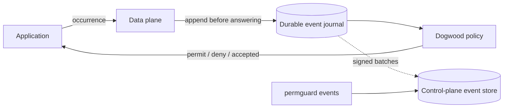

<!-- Copyright (c) 2022 Nitro Agility S.r.l. -->
<!-- SPDX-License-Identifier: Apache-2.0 -->

# The Dogwood session-access lab

This is a live temporal-authorization demo:

> may Alice read now, given that she logged in earlier and has not logged out?

A stateless request cannot answer that question. Dogwood evaluates the new
occurrence against the durable history Permguard has already observed.



The policy is adapted from Dogwood's `read_login_not_logout` example. Permguard
adds the packaging, durable journal, signed replication, CLI and control-plane
read path around it.

## What is in the example

```text
governance/read-after-login.dw   temporal policy
governance/schema.cedarschema    principals, resources, actions and request context
governance/events.dwschema       event kinds, logged fields, pins and time window
events/                          the successful trace
refusals/                        malformed or conflicting submissions
tests/session-access.yml         eight deterministic offline cases
manifest.yml                     Dogwood runtime, partition and temporal profile
```

The live lab uses two terminals and starts from the repository root. It needs
`task`, `curl` and `jq`. Every CLI block uses `task cli --`, so an installed
`permguard` binary is not required. That wrapper deliberately does not propagate
CLI refusal exit codes; automation should invoke the installed binary directly.

## Step 1 — Start the experimental planes

In terminal 1:

```bash
task run:experimental
```

This starts one all-in-one process with:

| Surface | Address | Purpose |
| --- | --- | --- |
| Control plane | `http://127.0.0.1:7556` | policies and replicated event evidence |
| Data plane | `http://127.0.0.1:7656` | event ingestion and temporal decisions |
| Telemetry | `http://127.0.0.1:7558` | health and metrics |

Dogwood is deliberately disabled by the ordinary `task run:all`; the temporal
contract is still `v1alpha1` and must be enabled explicitly.

## Step 2 — Establish event trust

In terminal 2, publish the data plane's generated public keys where the local
control-plane configuration expects them:

```bash
mkdir -p .volume/all-in-one/trust
curl -fsS http://127.0.0.1:7656/data-plane/keys \
  -o .volume/all-in-one/trust/data-plane-events.jwks
```

No private key moves. The control plane reloads this JWKS without a restart and
accepts it only for the producer and tenant scope declared in
`config.local-experimental.yml`.

## Step 3 — Create and publish the ledger

```bash
task cli -- zones create acme
task cli -- ledgers create --zone acme agent-governance

task cli -- -w examples/dogwood-session-access \
  init agent-governance --language dogwood
task cli -- -w examples/dogwood-session-access \
  remote add origin http://127.0.0.1:7556
task cli -- -w examples/dogwood-session-access validate
task cli -- -w examples/dogwood-session-access \
  checkout origin/acme/agent-governance
task cli -- -w examples/dogwood-session-access plan
task cli -- -w examples/dogwood-session-access \
  apply -m "Dogwood session access policy"
```

`plan` should contain one policy:

```text
+ governance/read_after_login.dw

Plan: 1 to create, 0 to update, 0 to delete (0 unchanged).
```

Give the mirror one local synchronization round:

```bash
sleep 20
```

## Step 4 — Prove the policy before sending events

```bash
task cli -- -w examples/dogwood-session-access test
```

Expected result:

```text
8 case(s), 8 passed, 0 failed.
```

These are deterministic offline cases. They include a read more than one hour
after login without weakening the live plane's five-minute lateness protection.

## Step 5 — Run the live trace

The JSON fixtures intentionally contain fixed timestamps so the offline suite is
reproducible. A live plane correctly refuses old occurrences. This helper keeps
the fixtures unchanged and gives each submitted copy a current timestamp and a
unique event ID:

```bash
DEMO_ID="demo-$(date +%s)"

submit() {
  file="$1"
  suffix="$2"

  jq --arg event_id "${DEMO_ID}-${suffix}" \
    '.event.data.event_id = $event_id
     | .event.data.occurred_at = (now | todate)' "$file" |
    curl -sS -X POST http://127.0.0.1:7656/temporal/v1alpha1/events \
      -H 'content-type: application/json' --data-binary @- |
    jq
}
```

Submit Alice's login request and its response:

```bash
submit examples/dogwood-session-access/events/1-login-request.json login-request
submit examples/dogwood-session-access/events/2-login-response.json login-response
```

The request is a decision kind and is denied because no policy permits a login.
The response is history-only and therefore returns `"outcome": "accepted"`
without inventing a decision.

Now ask about the read:

```bash
submit examples/dogwood-session-access/events/3-read-permitted.json read-permitted
```

The important fields are:

```json
{
  "outcome": "decided",
  "decision": true,
  "history": { "mode": "local" }
}
```

Alice's login does not authorize Bob:

```bash
submit examples/dogwood-session-access/events/5-read-other-user.json read-other-user
```

```json
{
  "outcome": "decided",
  "decision": false,
  "reason": { "code": "not_permitted" }
}
```

| Occurrence | Outcome | Meaning |
| --- | --- | --- |
| Alice `Login::request` | decided, deny | recording an event does not imply permitting its action |
| Alice `Login::response` | accepted | stored in history; no verdict applies to this event kind |
| Alice `Read::request` | decided, permit | her login is inside the one-hour window |
| Bob `Read::request` | decided, deny | Alice and Bob have different pinned histories |

### Optional restart checkpoint

After the login response, stop terminal 1 with `Ctrl-C`, run
`task run:experimental` again, wait for it to become ready and then submit the
read. It is still permitted: the journal is replayed before Dogwood answers, so a
restart is not an empty history.

## Step 6 — Read and verify the replicated evidence

The signed records use immutable zone and ledger IDs. Resolve them once from the
catalog:

```bash
ZONE_ID="$(task cli -- zones list -o json |
  jq -r '.zones[] | select(.name == "acme") | .id')"
LEDGER_ID="$(task cli -- ledgers list --zone acme -o json |
  jq -r '.ledgers[] | select(.name == "agent-governance") | .id')"

sleep 6
```

The six seconds allow the local event shipper to complete one round. Now read
from the control plane, not from the data plane's working journal:

```bash
task cli -- events list --zone "$ZONE_ID" --ledger "$LEDGER_ID"

task cli -- events get "${DEMO_ID}-read-permitted" \
  --zone "$ZONE_ID" --ledger "$LEDGER_ID" -o json
```

Verify the Merkle inclusion paths and the signed batch against the independently
saved JWKS:

```bash
task cli -- events verify \
  --zone "$ZONE_ID" --ledger "$LEDGER_ID" \
  --keys .volume/all-in-one/trust/data-plane-events.jwks
```

Expected summary for the four-event trace:

```text
coverage    4 examined, 4 returned
inclusion   4 record(s) proven in a signed batch
signatures  1 verified, 0 failed
```

The exact batch count can be higher if the shipper divided the trace across more
than one batch; zero failed signatures is the invariant.

## Step 7 — Watch invalid events fail closed

Reuse the helper. The last call deliberately reuses the ID of the read already
stored, but changes its content:

```bash
submit examples/dogwood-session-access/refusals/unknown-action.json unknown-action
submit examples/dogwood-session-access/refusals/undeclared-field.json undeclared-field
submit examples/dogwood-session-access/refusals/pin-disagrees.json pin-disagrees
submit examples/dogwood-session-access/refusals/conflicting-retry.json read-permitted
```

| Submission | HTTP | Code | Why |
| --- | ---: | --- | --- |
| unknown action | 400 | `event_action_undeclared` | no loaded schema declares it |
| undeclared field | 400 | `event_field_undeclared` | the engine could not observe the extra field |
| caller-supplied conflicting pin | 400 | `event_pin_contradicted` | callers cannot choose another principal's history |
| same ID, different occurrence | 409 | `event_id_conflict` | one ID cannot name two events |

Nothing is accepted after silently dropping the offending part.

## Why the partition has two schemas

```text
one occurrence
├── action schema: principal, resource, action and request context
└── event schema:  event kind, logged fields, pins and maximum window
```

That is why the manifest declares typed `artifacts` instead of `schema: true`:

```yaml
artifacts:
  - { type: permguard.dogwood.action-schema.v1, required: true }
  - { type: permguard.dogwood.event-schema.v1, required: false }
input: { type: permguard.dogwood.event.v1, required: true }
```

The event schema pins `callerPrincipal` to the request principal. Permguard
derives the pin from that authoritative field; a caller cannot route an event
into somebody else's history by writing the pin themselves.

## Reset the local lab

Stop the process first. To remove only the policy catalog entry:

```bash
task cli -- ledgers delete --zone acme agent-governance
```

To discard every local all-in-one demo artifact — catalog, journals, audit logs
and generated development keys — remove its explicitly scoped volume:

```bash
rm -rf .volume/all-in-one
rm -rf examples/dogwood-session-access/.permguard
```

Do not use that second reset against a volume containing data you intend to keep.

## Origin and stability

Adapted from Dogwood's Apache-2.0
[`dogwood-docs/examples/read_login_not_logout`](https://github.com/dogwood-policy/dogwood/tree/main/dogwood-docs/examples/read_login_not_logout)
example. The reviewed revision and full attribution are in
[`NOTICE.md`](../../NOTICE.md). Neither Amazon nor the Dogwood maintainers
endorse this integration.

Dogwood support is **experimental**. Its API and replication contracts are
`v1alpha1`, and a deployment serves them only when
`experimental.dogwood.enabled: true` and the corresponding event surfaces are
enabled.
