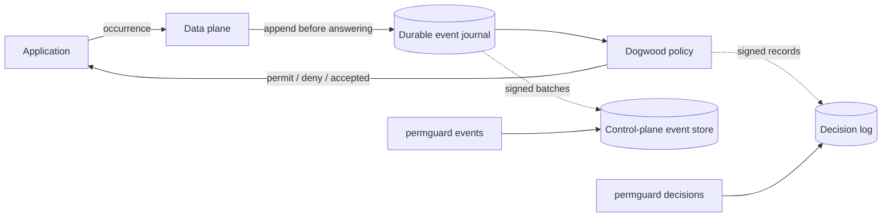

<!-- Copyright (c) 2022 Nitro Agility S.r.l. -->
<!-- SPDX-License-Identifier: Apache-2.0 -->

# The Dogwood session-access lab

This is a live temporal-authorization demo:

> may Alice read now, given that she logged in earlier and has not logged out?

A stateless request cannot answer that question. Dogwood evaluates the new
occurrence against the durable history Permguard has already observed.



Two logs, and the walkthrough reads both. The event store holds **what
happened**; the decision log holds **what was concluded from it**. They are not
two views of one record: the same read appears once in each, denied in the first
pass and permitted in the second, while the login response appears only in the
event store because nothing judged it.

The policy is adapted from Dogwood's `read_login_not_logout` example. Permguard
adds the packaging, durable journal, signed replication, CLI and control-plane
read path around it.

## What is in the example

```text
governance/read-after-login.dw   temporal policy
governance/schema.cedarschema    principals, resources, actions and request context
governance/events.dwschema       event kinds, logged fields, pins and time window
events/                          what happens: the login that builds the history
requests/                        what is asked: the reads whose verdict is the point
refusals/                        malformed or conflicting submissions
tests/session-access.yml         eight deterministic offline cases
manifest.yml                     Dogwood runtime, partition and temporal profile
```

`events/` and `requests/` hold the same kind of document — a Dogwood occurrence —
and the split is about role, not type. Every occurrence is both a fact and a
question, which is why `events/1-login-request.json` appears in the offline suite
as a request in one case and as history in three others. What separates the two
directories is which half the walkthrough below is using it for.

`requests/1-read-before-login.json` and `requests/2-read-inside-window.json` are
byte-identical apart from their event id and their instant:

```bash
diff <(jq 'del(.event.data.event_id, .event.data.occurred_at)' \
        examples/dogwood-session-access/requests/1-read-before-login.json) \
     <(jq 'del(.event.data.event_id, .event.data.occurred_at)' \
        examples/dogwood-session-access/requests/2-read-inside-window.json)
```

That silence is the example. The same question is denied and then permitted, and
nothing about the question changed.

The live lab uses two terminals and starts from the repository root. It needs
`task`, `curl` and `jq`. Every CLI block uses `task cli --`, so an installed
`permguard` binary is not required. That wrapper deliberately does not propagate
CLI refusal exit codes; automation should invoke the installed binary directly.

## Step 1 — Start the experimental planes

In terminal 1:

```bash
task run:experimental
```

This starts one all-in-one process with:

| Surface | Address | Purpose |
| --- | --- | --- |
| Control plane | `http://127.0.0.1:6443` | policies and replicated event evidence |
| Data plane | `http://127.0.0.1:7443` | event ingestion and temporal decisions |
| Server Host / operations | `http://127.0.0.1:5443` | process discovery, health, readiness, version, and metrics |

Dogwood is deliberately disabled by the ordinary `task run:all`; the temporal
contract is still `v1alpha1` and must be enabled explicitly.

## Step 2 — Establish event trust

In terminal 2, publish the data plane's generated public keys where the local
control-plane configuration expects them:

```bash
mkdir -p .volume/all-in-one/trust
curl -fsS http://127.0.0.1:7443/data-plane/keys \
  -o .volume/all-in-one/trust/data-plane-events.jwks
```

No private key moves. The control plane reloads this JWKS without a restart and
accepts it only for the producer and tenant scope declared in
`config.local-experimental.yml`.

## Step 3 — Create and publish the ledger

```bash
task cli -- zones create acme
task cli -- ledgers create --zone acme agent-governance

task cli -- -w examples/dogwood-session-access \
  init agent-governance --language dogwood
task cli -- -w examples/dogwood-session-access \
  remote add origin http://127.0.0.1:6443
task cli -- -w examples/dogwood-session-access validate
task cli -- -w examples/dogwood-session-access \
  checkout origin/acme/agent-governance
task cli -- -w examples/dogwood-session-access plan
task cli -- -w examples/dogwood-session-access \
  apply -m "Dogwood session access policy"
```

`plan` should contain one policy:

```text
+ governance/read_after_login.dw

Plan: 1 to create, 0 to update, 0 to delete (0 unchanged).
```

Give the mirror one local synchronization round:

```bash
sleep 20
```

## Step 4 — Prove the policy before sending events

```bash
task cli -- -w examples/dogwood-session-access test
```

Expected result:

```text
8 case(s), 8 passed, 0 failed.
```

These are deterministic offline cases. They include a read more than one hour
after login without weakening the live plane's five-minute lateness protection.

## Step 5 — Prepare the live run

The JSON fixtures intentionally contain fixed timestamps so the offline suite is
reproducible. A live plane correctly refuses old occurrences. `submit.sh` keeps
the fixtures unchanged and gives each submitted copy a current timestamp and a
run-scoped event ID. Pick one session ID and keep it for the whole trace:

```bash
export PERMGUARD_DEMO_ID="demo-$(date +%s)"
```

The script accepts a path relative to either the current directory or the
example itself. `--endpoint` can target another data plane; by default it uses
`http://127.0.0.1:7443`.

> **This walkthrough starts from an empty history.** The event schema pins
> `callerPrincipal`, so alice's history belongs to alice and outlives the run —
> and the policy looks back one hour. Step 6 is a deny *because nothing has
> happened yet*, so it only reads that way on a lab where alice has not logged in
> within the last hour. If you are running this a second time, reset first with
> the section at the end. Step 9 makes the same point without any precondition.

## Step 6 — Ask before anything has happened

Alice asks to read. No login exists, in this history or any other:

```bash
./examples/dogwood-session-access/submit.sh requests/1-read-before-login.json
```

```json
{
  "outcome": "decided",
  "decision": false,
  "reason": {
    "code": "not_permitted",
    "message": "no policy permitted it against this partition's history"
  },
  "history": { "mode": "local" }
}
```

Read the message rather than the boolean. Nothing was misconfigured and no policy
failed: the request is well formed, the policy is loaded, and the history it
ranges over is empty. `permguard events` will show this occurrence recorded — a
refused *question* is still something that happened.

## Step 7 — Make something happen

Submit Alice's login request and its response:

```bash
./examples/dogwood-session-access/submit.sh events/1-login-request.json
./examples/dogwood-session-access/submit.sh events/2-login-response.json
```

The request is a decision kind and is denied, because no policy permits a login —
recording an event does not imply permitting its action. The response is
history-only and returns `"outcome": "accepted"` without inventing a decision:

```json
{ "outcome": "accepted", "history": { "mode": "local" } }
```

## Step 8 — Ask the same question again

```bash
./examples/dogwood-session-access/submit.sh requests/2-read-inside-window.json
```

```json
{
  "outcome": "decided",
  "decision": true,
  "policies": ["6079fd0b-0405-849a-a5a2-626c007b399b"],
  "reason": {
    "code": "permitted",
    "message": "a policy permitted it against this partition's history"
  },
  "history": { "mode": "local" }
}
```

The policy identity will differ on your run; what matters is that a permit now
cites one. The request in step 6 and the request here are the same document. What
changed is the past between them, and that is the entire claim the example makes:
a stateless PDP given both of these has no way to answer them differently.

### Optional restart checkpoint

Before this step, stop terminal 1 with `Ctrl-C`, run `task run:experimental`
again, wait for it to become ready and then submit the read. It is still
permitted: the journal is replayed before Dogwood answers, so a restart is not an
empty history.

## Step 9 — Another principal's login is not yours

```bash
./examples/dogwood-session-access/submit.sh requests/4-read-other-user.json
```

Bob is denied, and the response says why without the policy having to:

```json
{
  "decision": false,
  "reason": { "code": "not_permitted" },
  "watermark": { "history": "sha256:06992735…" }
}
```

Compare that `watermark.history` with the digest returned for alice's reads. They
are different histories, and alice's login is not invisible to bob because a rule
checks — it is invisible because it is not in the history his request ranges over.

| Submission | Outcome | Meaning |
| --- | --- | --- |
| alice `Read::request`, before | decided, deny | the history it ranges over is empty |
| alice `Login::request` | decided, deny | recording an event does not imply permitting its action |
| alice `Login::response` | accepted | stored in history; no verdict applies to this event kind |
| alice `Read::request`, after | decided, permit | her login is inside the one-hour window |
| bob `Read::request` | decided, deny | alice and bob have different pinned histories |

`requests/3-read-outside-window.json` has no live step. `submit.sh` stamps every
submission with the current time, so a fixture cannot be an hour old on arrival;
the closed window is proven offline instead, by the fourth case in step 4.

## Step 10 — Read the events back from the CLI

The signed records use immutable zone and ledger IDs. Resolve them once from the
catalog:

```bash
ZONE_ID="$(task cli -- zones list -o json |
  jq -r '.zones[] | select(.name == "acme") | .id')"
LEDGER_ID="$(task cli -- ledgers list --zone acme -o json |
  jq -r '.ledgers[] | select(.name == "agent-governance") | .id')"

sleep 6
```

> **`events` is scoped by ID, not by name.** `--zone acme` is accepted and
> matches nothing, so a mistyped scope reports `No events` rather than an error.
> An empty answer here means "no records under that scope", never "this ledger is
> empty". `decisions` in step 11 is scoped the other way, by name.

The six seconds allow the local event shipper to complete one round. Now read
from the control plane, not from the data plane's working journal:

```bash
task cli -- events list --zone "$ZONE_ID" --ledger "$LEDGER_ID"
```

```text
  ~      1  2026-08-29T20:01:39Z  demo-1788033699-read-before-login request
         at commit d7b1467305b7 profile temporal
         history   callerPrincipal
  ~      2  2026-08-29T20:01:48Z  demo-1788033699-login-request request
  +      3  2026-08-29T20:01:48Z  demo-1788033699-login-response response
  ~      4  2026-08-29T20:01:48Z  demo-1788033699-read-inside-window request
  ~      5  2026-08-29T20:01:58Z  demo-1788033699-read-other-user request

  coverage    5 examined, 5 returned

  Caught up.
```

The glyph is the event's *kind*, not its verdict — `+` marks a response and `~`
ordinary history. The permitted read and the denied one look identical here, and
that is correct: this store records what happened. What was decided is a separate
log, read in step 11.

One occurrence in full, by the identifier its caller stated:

```bash
task cli -- events get "${PERMGUARD_DEMO_ID}-read-inside-window" \
  --zone "$ZONE_ID" --ledger "$LEDGER_ID" -o json
```

To watch them arrive instead of listing what is held, leave this running in a
third terminal while you submit:

```bash
task cli -- events tail --zone "$ZONE_ID" --ledger "$LEDGER_ID" --follow
```

Then verify the Merkle inclusion paths and the signed batches against the
independently saved JWKS:

```bash
task cli -- events verify \
  --zone "$ZONE_ID" --ledger "$LEDGER_ID" \
  --keys .volume/all-in-one/trust/data-plane-events.jwks
```

```text
  coverage    5 examined, 5 returned
  inclusion   5 record(s) proven in a signed batch
  signatures  3 verified, 0 failed
```

The batch count depends on how the shipper divided the trace and will differ
between runs; zero failed signatures is the invariant. `--keys` is required by
design: an inclusion path supplied by the same archive proves nothing about who
produced it until the batch envelope verifies against a key obtained elsewhere.

## Step 11 — Read what was decided

The events are what happened. The decisions are what Permguard concluded, and
they are a different log with a different scope — **by name here, not by ID**:

```bash
task cli -- decisions list --zone acme --ledger agent-governance
```

```text
  ~      1  marker  sampling permits=1.0, build 0.1.0
  -      2  2026-08-29T20:01:39Z  Drupe::OAuthUser:v1:6cd37c23… Drupe::Action::Read  Drupe::Gateway:gw1
  -      3  2026-08-29T20:01:48Z  Drupe::OAuthUser:v1:6cd37c23… Drupe::Action::Login Drupe::Gateway:gw1
  +      4  2026-08-29T20:01:48Z  Drupe::OAuthUser:v1:6cd37c23… Drupe::Action::Read  Drupe::Gateway:gw1
         policy 6079fd0b-0405-849a-a5a2-626c007b399b
  -      5  2026-08-29T20:01:58Z  Drupe::OAuthUser:v1:87b67b89… Drupe::Action::Read  Drupe::Gateway:gw1

4 decision(s), 1 permitted, 3 denied.
```

Three things are worth reading twice.

**Five events produced four decisions.** The login *response* is history-only, so
it has no line here. An occurrence that is recorded is not necessarily an
occurrence that was judged.

**Records 2 and 4 are the same request.** Same subject, same action, same
resource, one denied and one permitted, and only record 4 cites a policy. A deny
has nothing to cite, which is why the `policies` list is empty rather than absent.

**Subjects are pseudonymised.** `v1:6cd37c23…` is alice and `v1:87b67b89…` is bob,
consistently within this store and meaningless outside it. The decision log is
built to be kept and shown; it is not built to leak who was asking.

## Step 12 — Watch invalid events fail closed

Reuse the same session. The last fixture carries the same original event ID as
the permitted read, so the script deliberately generates the same live ID over
different content:

```bash
./examples/dogwood-session-access/submit.sh refusals/unknown-action.json
./examples/dogwood-session-access/submit.sh refusals/undeclared-field.json
./examples/dogwood-session-access/submit.sh refusals/pin-disagrees.json
./examples/dogwood-session-access/submit.sh refusals/conflicting-retry.json
```

Each refusal prints its JSON body and HTTP status, then exits non-zero as a real
client should. Those non-zero exits are expected in this step.

| Submission | HTTP | Code | Why |
| --- | ---: | --- | --- |
| unknown action | 400 | `event_action_undeclared` | no loaded schema declares it |
| undeclared field | 400 | `event_field_undeclared` | the engine could not observe the extra field |
| caller-supplied conflicting pin | 400 | `event_pin_contradicted` | callers cannot choose another principal's history |
| same ID, different occurrence | 409 | `event_id_conflict` | one ID cannot name two events |

The pin refusal is the one to read in full:

```text
`logged.callerPrincipal` was sent as {"__entity":{"type":"Drupe::OAuthUser","id":"bob"}}
and this partition's schema pins it to principal, which is
{"__entity":{"type":"Drupe::OAuthUser","id":"alice"}}. A pin decides which history the
event belongs to, so it is derived from the request's authoritative roots and never
taken from the caller
```

Nothing is accepted after silently dropping the offending part. None of these
four reach `events list`: a refused submission is not a recorded one, which is
what separates them from the denied read in step 6.

## Why the partition has two schemas

```text
one occurrence
├── action schema: principal, resource, action and request context
└── event schema:  event kind, logged fields, pins and maximum window
```

That is why the manifest declares typed `artifacts` instead of `schema: true`:

```yaml
artifacts:
  - { type: permguard.dogwood.action-schema.v1, required: true }
  - { type: permguard.dogwood.event-schema.v1, required: false }
input: { type: permguard.dogwood.event.v1, required: true }
```

The event schema pins `callerPrincipal` to the request principal. Permguard
derives the pin from that authoritative field; a caller cannot route an event
into somebody else's history by writing the pin themselves.

## Reset the local lab

Stop the process first. To remove only the policy catalog entry:

```bash
task cli -- ledgers delete --zone acme agent-governance
```

To discard every local all-in-one demo artifact — catalog, journals, audit logs
and generated development keys — remove its explicitly scoped volume:

```bash
rm -rf .volume/all-in-one
rm -rf examples/dogwood-session-access/.permguard
```

Do not use that second reset against a volume containing data you intend to keep.

## Origin and stability

Adapted from Dogwood's Apache-2.0
[`dogwood-docs/examples/read_login_not_logout`](https://github.com/dogwood-policy/dogwood/tree/main/dogwood-docs/examples/read_login_not_logout)
example. The reviewed revision and full attribution are in
[`THIRD_PARTY_NOTICES.md`](../../THIRD_PARTY_NOTICES.md). Neither Amazon nor the Dogwood maintainers
endorse this integration.

Dogwood support is **experimental**. Its API and replication contracts are
`v1alpha1`, and a deployment serves them only when
`experimental.dogwood.enabled: true` and the corresponding event surfaces are
enabled.
